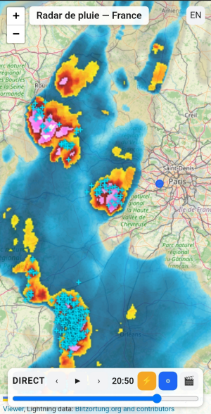

<div align="center">

<h1>
  <picture>
    <source media="(prefers-color-scheme: dark)" srcset="docs/logo-dark.svg">
    
  </picture>
  &nbsp;Rain Radar
</h1>

### Votre radar pluie et orages en une seule web app. Sans pub, multiplateforme.

[](https://github.com/hleroy/rainradar/actions/workflows/ci.yml)
[](#-tests)
[](#)
[](LICENSE)
[](#)

<br>



<br>

👉 **[rainradar.hleroy.com](https://rainradar.hleroy.com)**

</div>

---

**Rain Radar** affiche en direct la **pluie** et les **orages** sur toute la France,
sur une carte OpenStreetMap. Rejouez les dernières heures, remontez jusqu'à
**90 jours** en arrière, partagez une courte vidéo de la situation — le tout
**gratuitement**, **sans publicité ni pistage**, et **installable** comme une vraie
application sur votre téléphone.

## ✨ Fonctionnalités

- 🌧️ **Radar de précipitations en direct** — animation des ~2 dernières heures, mise à jour en continu.
- ⚡ **Foudre en temps réel** — impacts live et historiques (réseau [Blitzortung](https://www.blitzortung.org)), colorés par ancienneté.
- 🕰️ **Archive de 90 jours** — revenez à n'importe quelle date et heure passée avec le sélecteur.
- 🎬 **Export vidéo** — générez un court clip MP4 de la situation et partagez-le (WhatsApp, Signal…).
- 🔔 **Alertes orage** — soyez notifié quand la foudre frappe à moins de 30 ou 10 km d'un point de votre choix, **même application fermée** (notifications push, sur les navigateurs et appareils compatibles — sur iPhone/iPad, installez d'abord l'app). À titre informatif, ce n'est pas une alerte de sécurité.
- 👆 **Zoom à une main** — double-tapez puis, sans relever le doigt, glissez vers le bas pour zoomer, vers le haut pour dézoomer (comme sur Google Maps).
- 📲 **Installable (PWA)** — ajoutez-la à votre écran d'accueil ; elle se lance comme une app et démarre même hors-ligne.
- 🔒 **Sans pub, sans pistage** — aucune publicité, aucun tracker, aucun compte.
- 🌍 **Bilingue** — interface en français et en anglais.

## 🛡️ Confidentialité

Pas de pub, pas de cookies, pas de compte, pas de mouchard. Votre navigateur ne
contacte **jamais** directement les fournisseurs de données : les tuiles radar sont
archivées et servies par notre propre serveur, et la foudre arrive via un flux
temps réel maison.

## 🧰 Sous le capot

- **Backend** — Django 6 (vues async) + PostgreSQL + Redis
- **Frontend** — JavaScript vanilla + [Leaflet](https://leafletjs.com), sans build ni bundler
- **Données** — [RainViewer](https://www.rainviewer.com) & [Météo-France](https://meteofrance.fr) (radar, source au choix) & [Blitzortung.org](https://www.blitzortung.org) (foudre)

<details>
<summary>🚀 Démarrage rapide (développeurs)</summary>

```bash
docker compose -f docker-compose.local.yml up --build
# puis ouvrir http://localhost:8000
```

Architecture, déploiement, configuration et conventions sont décrits dans
[`CLAUDE.md`](CLAUDE.md) et la conception détaillée dans
[`specs/rain-lightning-radar-design.md`](specs/rain-lightning-radar-design.md).

</details>

## 🧪 Tests

Suite **dockerisée** (pytest + couverture ≥ 85 % sur `radar/`, ruff) :

```bash
just pytest
```

## 📜 Attribution & licence

- **Radar** : [RainViewer](https://www.rainviewer.com) · [Météo-France](https://meteofrance.fr) (Licence Ouverte 2.0, quand cette source est active) · **Fond de carte** : © [OpenStreetMap](https://www.openstreetmap.org/copyright) · **Foudre** : [Blitzortung.org](https://www.blitzortung.org) et contributeurs (usage **non commercial**)
- Ces crédits sont obligatoires et restent affichés dans l'application.

Projet sous licence **[GNU AGPL-3.0-or-later](LICENSE)**.
